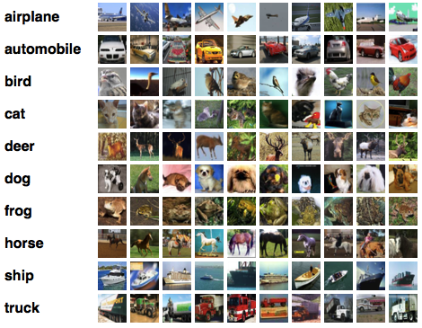
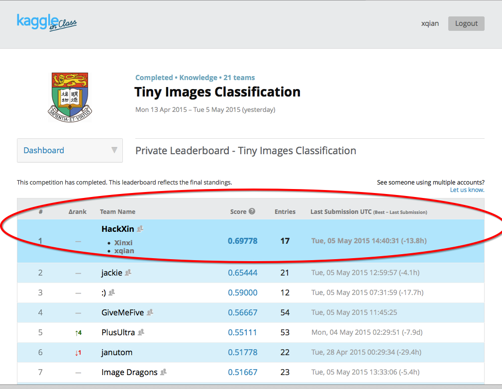

### Kaggle in Class, Tiny Image Classification, CIFAR-10

Group project for HKU COMP3314_CSIS0314(Spring 2015), attacking a real world machine learning problem of classifying tiny images from a subset of CIFAR-10. Our result ranks top 1 among all groups. 

  

For more details, please click on the [Kaggle page](https://inclass.kaggle.com/c/tiny-images-classification) or refer to Specification.pdf.  

More on our methods and results, please refer to Final Report.   

Find us on the Leader Board. Cheers!  

  

In our project, implementation has modified and re-distribute the [minFunc optimization package](http://www.cs.ubc.ca/~schmidtm/Software/minFunc.html) and the [matlab kmeans demo of paper "Analysis of Single Layer Unsupervised Feature Learning"](http://ai.stanford.edu/~ang/papers/nipsdlufl10-AnalysisSingleLayerUnsupervisedFeatureLearning.pdf). 
For minFunc optimization package
----------------------------------
See:  http://www.cs.ubc.ca/~schmidtm/Software/minFunc.html

minFunc, written by Mark Schmidt, whose license follows:

"This software is made available under the Creative Commons 
Attribution-Noncommercial License.  You are free to use, copy, modify, and 
re-distribute the work.  However, you must attribute any re-distribution or 
adaptation in the manner specified below, and you may not use this work for 
commercial purposes without the permission of the author.

Any re-distribution or adaptation of this work must contain the author's name 
and a link to the software's original webpage.  For example, any 
re-distribution of the 'minFunc' software must contain a link to:
http://www.cs.ubc.ca/~schmidtm/Software/minFunc.html

This software comes with no guarantees, and all use of these codes is
entirely at the user's own risk."

For kmeans demo matlab code
----------------------------------
See:  http://www.cs.stanford.edu/~acoates/

kmeans demo, provided by Adam Coates on paper Analysis of Single Layer Unsupervised Feature Learning.

